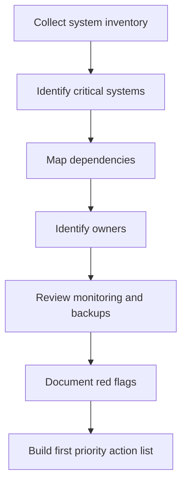

# Infrastructure Discovery Workflow

```mermaid
flowchart TD
    A[Collect system inventory] --> B[Identify critical systems]
    B --> C[Map dependencies]
    C --> D[Identify owners]
    D --> E[Review monitoring and backups]
    E --> F[Document red flags]
    F --> G[Build first priority action list]
```
