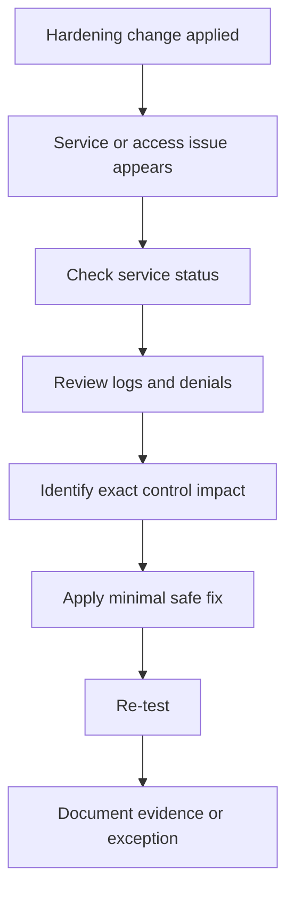

# STIG Troubleshooting Workflow

```mermaid
flowchart TD
    A[Hardening change applied] --> B[Service or access issue appears]
    B --> C[Check service status]
    C --> D[Review logs and denials]
    D --> E[Identify exact control impact]
    E --> F[Apply minimal safe fix]
    F --> G[Re-test]
    G --> H[Document evidence or exception]
```
