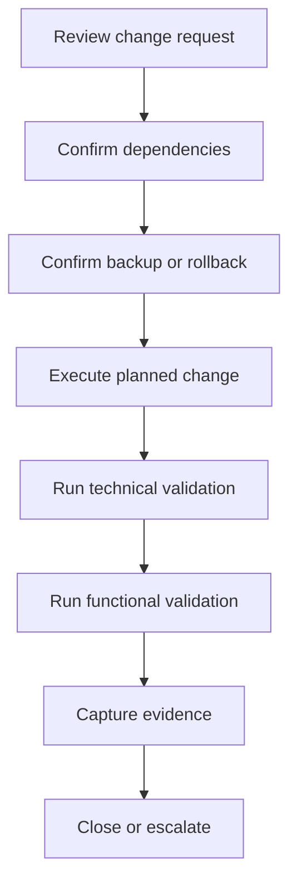

# Change and Validation Workflow

```mermaid
flowchart TD
    A[Review change request] --> B[Confirm dependencies]
    B --> C[Confirm backup or rollback]
    C --> D[Execute planned change]
    D --> E[Run technical validation]
    E --> F[Run functional validation]
    F --> G[Capture evidence]
    G --> H[Close or escalate]
```
