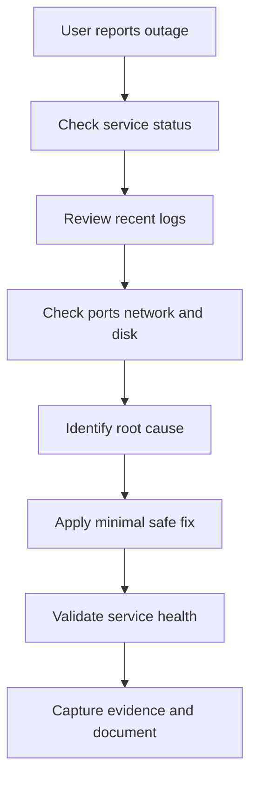

# Service Troubleshooting Workflow

```mermaid
flowchart TD
    A[User reports outage] --> B[Check service status]
    B --> C[Review recent logs]
    C --> D[Check ports network and disk]
    D --> E[Identify root cause]
    E --> F[Apply minimal safe fix]
    F --> G[Validate service health]
    G --> H[Capture evidence and document]
```
