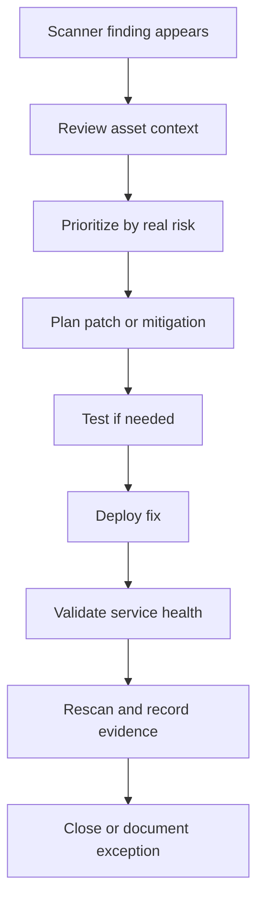

# Vulnerability Remediation Lifecycle

```mermaid
flowchart TD
    A[Scanner finding appears] --> B[Review asset context]
    B --> C[Prioritize by real risk]
    C --> D[Plan patch or mitigation]
    D --> E[Test if needed]
    E --> F[Deploy fix]
    F --> G[Validate service health]
    G --> H[Rescan and record evidence]
    H --> I[Close or document exception]
```
